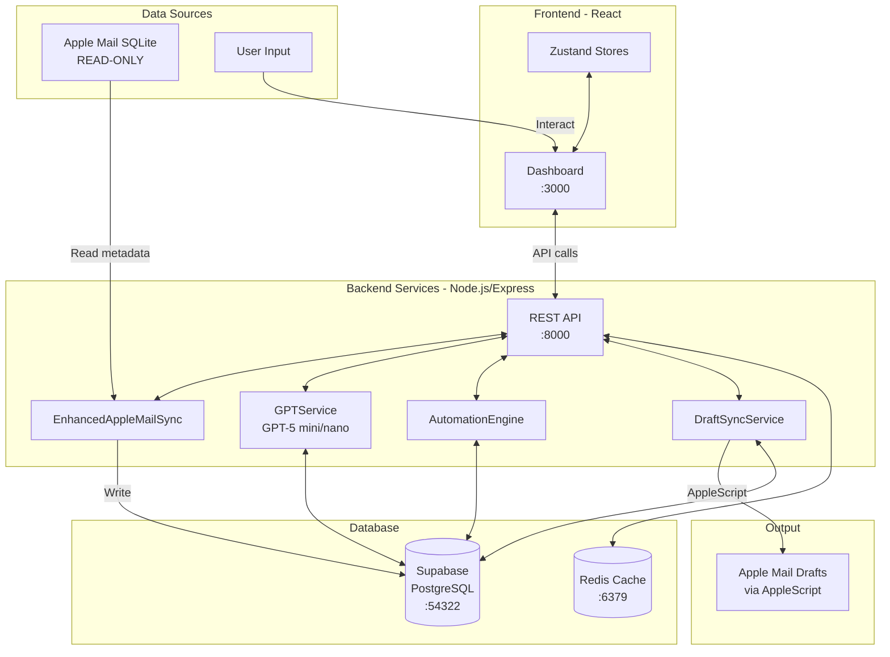

# Task Mail - Clean Architecture & Gap Analysis

## 🏗️ Current Clean Architecture

After removing unused/outdated files to `.old/`, here's the clean structure aligned with CLAUDE.md:

```
task-mail/
├── server.js                    # Main Express server (PORT: 8000)
├── ecosystem.config.js          # PM2 configuration
├── docker-compose.yml           # Supabase + Redis containers
│
├── src/                         # Backend Services
│   ├── services/               # Core Business Logic
│   │   ├── EnhancedAppleMailSync.js  ✅ # Apple Mail → Supabase sync
│   │   ├── GPTService.js            ✅ # Consolidated AI (GPT-5)
│   │   ├── AutomationEngine.js      ✅ # Rule-based automation
│   │   ├── DraftSyncService.js      ✅ # AppleScript draft sync
│   │   ├── EmailSyncService.js      ✅ # Email processing
│   │   └── AppleMailSyncEngine.js   ✅ # Advanced sync logic
│   │
│   ├── api/routes/             # REST API Endpoints
│   │   ├── index.js            ✅ # Route aggregator
│   │   ├── email-routes.js     ✅ # Email CRUD
│   │   ├── task-routes.js      ✅ # Task management
│   │   ├── ai-routes.js        ✅ # AI endpoints (UPDATED)
│   │   ├── sync-routes.js      ✅ # Sync control (UPDATED)
│   │   ├── automation-routes.js ✅ # Rules CRUD (NEW)
│   │   ├── user-routes.js      ✅ # User management
│   │   ├── health-routes.js    ✅ # Health checks
│   │   └── stats-routes.js     ✅ # Statistics
│   │
│   ├── database/               # Database Layer
│   │   ├── OptimizedDatabaseAgent.js ✅ # Main DB interface
│   │   ├── DatabaseHealthMonitor.js  ✅ # Health monitoring
│   │   └── services/                  ✅ # DB services
│   │
│   ├── middleware/             # Express Middleware
│   │   ├── auth.js             ✅ # JWT authentication
│   │   └── security.js         ✅ # Security middleware
│   │
│   └── lib/                    # Libraries
│       └── supabase.js         ✅ # Supabase client
│
├── dashboard/frontend/         # React Dashboard
│   ├── src/
│   │   ├── App.tsx             ✅ # Main app
│   │   ├── services/
│   │   │   └── api.ts          ✅ # API client (UPDATED)
│   │   │
│   │   ├── stores/             # Zustand State Management
│   │   │   ├── emailStore.ts   ✅ # Email state (UPDATED)
│   │   │   ├── taskStore.ts    ✅ # Task state
│   │   │   ├── aiStore.ts      ✅ # AI state (UPDATED)
│   │   │   └── automationStore.ts ✅ # Automation state (NEW)
│   │   │
│   │   └── components/         # UI Components
│   │       ├── Email/
│   │       │   └── ModernEmailInterface.tsx ✅
│   │       ├── TaskCentric/
│   │       │   └── TaskDashboard.tsx        ✅
│   │       ├── AI/
│   │       │   └── AIChat.tsx               ✅
│   │       ├── AIAssistant/
│   │       │   ├── ConversationalAIPanel.tsx ✅
│   │       │   └── DraftEditor.tsx          ✅
│   │       ├── Rules/
│   │       │   └── EmailRulesManager.tsx    ✅
│   │       └── EmailSync/
│   │           └── EmailSyncManager.tsx     ✅
│
├── database/                   # Database Schema
│   ├── migrations/            ✅ # Supabase migrations
│   └── apple_mail_replica.db  # SQLite (read-only)
│
└── supabase/                  # Supabase Config
    └── docker-compose.local.yml ✅
```

## 🔄 Data Flow Architecture



## ✅ Successfully Connected Components

### 1. **Email Sync Pipeline** ✅
```
Apple Mail SQLite → EnhancedAppleMailSync → Supabase
```
- Full field support (to, cc, bcc, subject, content, attachments)
- Read-only from Apple Mail
- All writes to Supabase

### 2. **AI Processing Pipeline** ✅
```
Email → GPTService → Classification/Draft/Tasks → Supabase
```
- Email classification
- Draft generation
- Task extraction
- RAG-powered search

### 3. **Draft Sync Pipeline** ✅
```
Supabase Drafts → DraftSyncService → AppleScript → Apple Mail
```
- Mac-only feature
- Creates drafts in Mail.app

### 4. **Automation Pipeline** ✅
```
Email → AutomationEngine → Rules Processing → Actions
```
- Rule-based filtering
- Auto-reply, categorization, flagging
- Task creation from rules

### 5. **Frontend-Backend Connection** ✅
```
React Components → Zustand Stores → API Service → Express Routes → Services
```
- Updated API endpoints in `api.ts`
- Stores using new endpoints
- JWT authentication flow

## 🔴 Identified Gaps & Issues

### 1. **Missing WebSocket Implementation** ❌
**Gap**: Real-time updates not fully implemented
```javascript
// src/websocket/WebSocketManager.js exists but not connected
// Frontend components expect real-time updates
```
**Fix Needed**:
- Connect WebSocketManager to server.js
- Update frontend stores to listen to WebSocket events

### 2. **Incomplete AI Store Integration** ⚠️
**Gap**: aiStore.ts still has methods using old `emailApi`
```javascript
// Line 142-180 in aiStore.ts
generateDraft: async (emailId, options) => {
  // Still using emailApi.generateDraft instead of endpoints.ai.generateDraft
}
```
**Fix Needed**:
- Update all async methods in aiStore to use new endpoints

### 3. **Missing Sync Status UI Updates** ❌
**Gap**: EmailSyncManager component not using new sync endpoints
```javascript
// dashboard/frontend/src/components/EmailSync/EmailSyncManager.tsx
// Still using mock data instead of real sync status
```
**Fix Needed**:
- Connect to `/sync/status`, `/sync/trigger` endpoints
- Show real sync progress

### 4. **Authentication Token Not Set** ⚠️
**Gap**: API interceptor doesn't automatically add auth token
```javascript
// src/services/api.ts line 15-22
// Token needs to be set from AuthContext
```
**Fix Needed**:
- Update AuthContext to set token in API interceptor
- Ensure token persistence

### 5. **Missing Environment Variables** ❌
**Gap**: Frontend expects these but they're not documented:
- `REACT_APP_API_URL`
- `REACT_APP_SUPABASE_URL`
- `REACT_APP_SUPABASE_ANON_KEY`

**Fix Needed**:
- Add to `.env` file
- Document in setup instructions

### 6. **Incomplete Error Handling** ⚠️
**Gap**: Some API calls don't handle errors properly
```javascript
// Various stores catch errors but don't show user feedback
```
**Fix Needed**:
- Add toast notifications for errors
- Implement retry logic for failed requests

### 7. **Missing Rate Limiting on Frontend** ❌
**Gap**: No debouncing on search/AI requests
**Fix Needed**:
- Add debounce to search inputs
- Implement request queuing for AI operations

### 8. **Database Connection Pool Not Configured** ⚠️
**Gap**: OptimizedDatabaseAgent doesn't use connection pooling
**Fix Needed**:
- Implement pg connection pool
- Add connection retry logic

## 📋 Priority Fixes

### High Priority (Breaking Issues)
1. **Fix aiStore.ts methods** - AI features won't work
2. **Set up WebSocket connection** - No real-time updates
3. **Fix authentication token flow** - API calls will fail
4. **Add missing env variables** - Frontend won't connect

### Medium Priority (Functionality Issues)
1. **Update EmailSyncManager UI** - Sync status not visible
2. **Implement error toasts** - User feedback missing
3. **Add connection pooling** - Performance issues at scale

### Low Priority (Enhancements)
1. **Add request debouncing** - Optimize API calls
2. **Implement retry logic** - Better error recovery
3. **Add loading skeletons** - Better UX

## 🚀 Quick Start Commands

```bash
# 1. Install dependencies
npm install
cd dashboard/frontend && npm install && cd ../..

# 2. Set up environment
cp .env.example .env
# Edit .env with your keys

# 3. Start infrastructure
docker-compose up -d

# 4. Initialize database
npm run db:init

# 5. Start services
pm2 start ecosystem.config.js

# 6. Or development mode
npm run dev
```

## 📊 Service Status Check

```bash
# Check all services
curl http://localhost:8000/api/health

# Check sync status
curl http://localhost:8000/api/sync/status \
  -H "Authorization: Bearer YOUR_TOKEN"

# Trigger email sync
curl -X POST http://localhost:8000/api/sync/trigger \
  -H "Authorization: Bearer YOUR_TOKEN" \
  -H "Content-Type: application/json" \
  -d '{"service": "email", "type": "full"}'
```

## 🎯 Next Steps

1. **Fix Critical Gaps**: Start with high-priority issues
2. **Test Integration**: Verify each pipeline works end-to-end
3. **Add Monitoring**: Implement logging and metrics
4. **Documentation**: Update README with setup instructions
5. **Security Audit**: Review auth flow and API security

