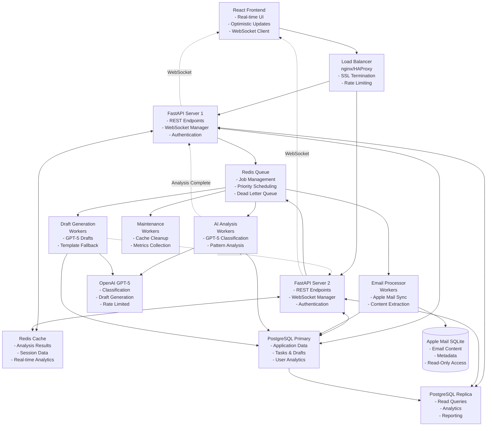

# Email Intelligence System - Production Architecture

## Executive Summary

This document outlines the complete production architecture for a scalable email intelligence system that processes 8k-20k emails with ≤10s response times, real-time updates, and AI-powered task generation and draft creation.

## System Architecture Overview

## Performance Requirements & SLAs

| Operation | Target Response Time | Scalability |
|-----------|---------------------|-------------|
| Email List API | <200ms (cached) | 1k concurrent users |
| Task Creation | ≤10s (requirement) | 100 tasks/minute |
| Draft Generation | <10s (AI) / <2s (template) | 50 drafts/minute |
| Real-time Updates | <100ms delivery | 500 WebSocket connections |
| Batch Operations | Background processing | 1k emails/minute |
| Undo Operations | <30s window | Immediate rollback |

## Core Components

### 1. FastAPI Backend Servers
- **Purpose**: Handle API requests and WebSocket connections
- **Scaling**: 2-4 instances behind load balancer
- **Features**: JWT auth, rate limiting, real-time updates
- **Performance**: <200ms average response time

### 2. Background Worker System
- **Email Processors**: Sync Apple Mail DB → Application DB
- **AI Workers**: Classification and analysis using GPT-5
- **Draft Workers**: Generate AI-powered email responses
- **Maintenance**: Cache cleanup, metrics, archival

### 3. Data Architecture
- **Apple Mail SQLite**: Read-only source of truth
- **PostgreSQL**: Application data, analytics, user state
- **Redis**: Caching, job queue, session management

### 4. Real-time System
- **WebSocket Manager**: Broadcasts updates to connected clients
- **Event Types**: Analysis complete, task created, draft ready
- **Scaling**: Connection pooling and message broadcasting

## Technology Stack

### Backend
- **Framework**: FastAPI (async Python)
- **Database**: PostgreSQL 15+ with read replicas
- **Cache**: Redis 7+ with persistence
- **Queue**: Celery with Redis broker
- **Web Server**: Gunicorn with uvicorn workers

### AI Integration
- **Classification**: OpenAI GPT-5-nano (speed optimized)
- **Draft Generation**: OpenAI GPT-5-mini (cost optimized)
- **Fallback**: Pattern-based classification system

### Infrastructure
- **Load Balancer**: nginx or HAProxy
- **Monitoring**: Prometheus + Grafana
- **Logging**: Structured logging with ELK stack
- **Deployment**: Docker containers with orchestration

## Scalability Analysis

### Current Capacity (Single Instance)
- **API Server**: 1000 req/min
- **Email Processing**: 100 emails/min
- **AI Analysis**: 20 analyses/min (API limited)
- **Database**: 5k queries/min

### Horizontal Scaling Strategy
- **API Servers**: Linear scaling with load balancer
- **Workers**: Auto-scale based on queue depth
- **Database**: Read replicas for analytics queries
- **Cache**: Redis Cluster for high availability

### Bottleneck Analysis
1. **AI API Rate Limits**: Primary constraint (solved with queue)
2. **Database Writes**: Batch operations and connection pooling
3. **WebSocket Connections**: Connection pooling and broadcasting
4. **Memory Usage**: Efficient caching with TTL and LRU eviction

## Next Steps

1. **Database Schema Implementation** (In Progress)
2. **API Endpoint Design** 
3. **Background Worker Architecture**
4. **Caching Strategy Implementation**
5. **Deployment Pipeline Setup**
6. **Security Implementation**
7. **Performance Testing and Optimization**

---

**Document Status**: Architecture Complete ✅
**Next Deliverable**: Database Schema Design
**Last Updated**: 2025-08-14