# Automation Workflow System Diagrams

## System Architecture Overview (C4 Level 1)

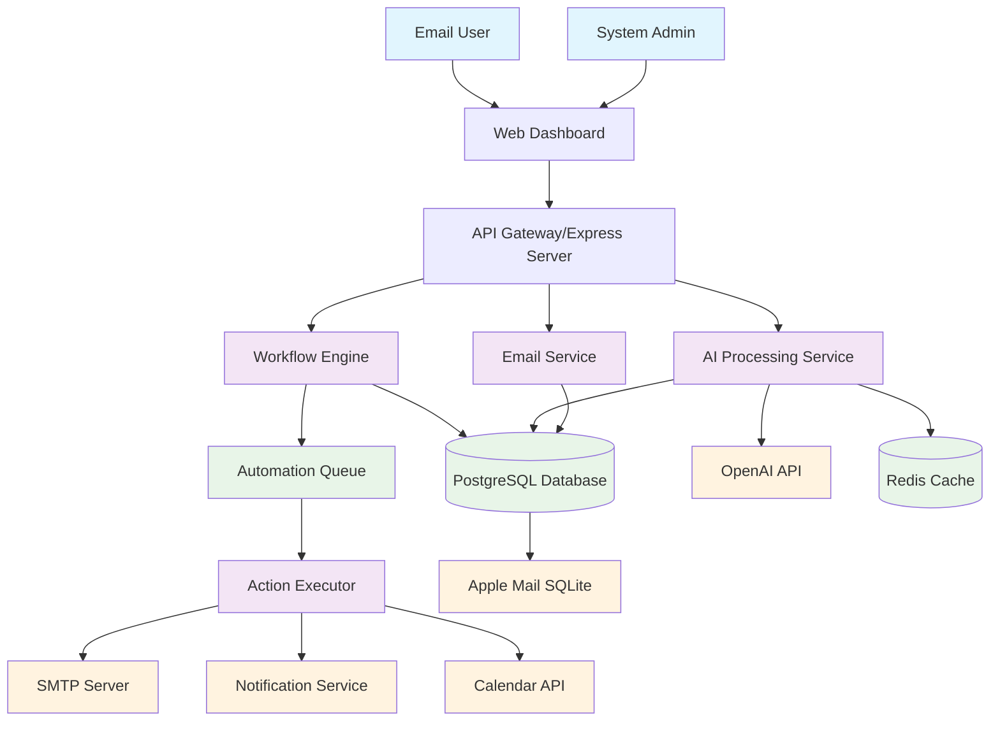

## Container Architecture (C4 Level 2)

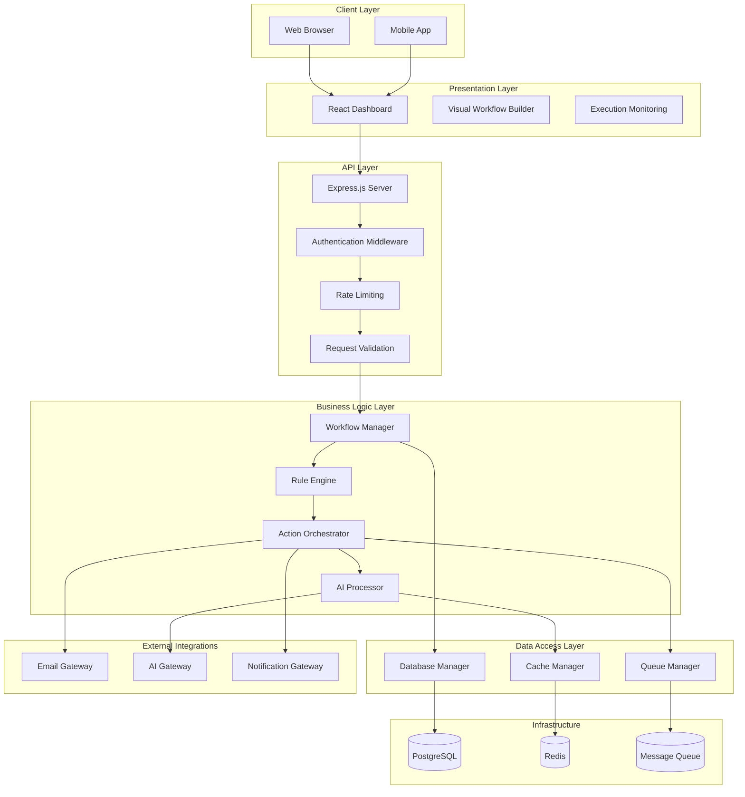

## Component Architecture (C4 Level 3)

### Workflow Builder Components

```mermaid
graph TB
    subgraph "Workflow Builder UI"
        Canvas[Workflow Canvas]
        NodePalette[Node Palette]
        PropertyPanel[Property Panel]
        ToolbarActions[Toolbar Actions]
    end
    
    subgraph "Canvas Components"
        NodeRenderer[Node Renderer]
        ConnectionRenderer[Connection Renderer]
        SelectionManager[Selection Manager]
        ViewportManager[Viewport Manager]
    end
    
    subgraph "Node Types"
        TriggerNodes[Trigger Nodes]
        ConditionNodes[Condition Nodes]
        ActionNodes[Action Nodes]
        LogicNodes[Logic Nodes]
    end
    
    subgraph "Validation System"
        SchemaValidator[Schema Validator]
        CircularDetector[Circular Dependency Detector]
        ConnectivityChecker[Connectivity Checker]
        ExecutionPathValidator[Execution Path Validator]
    end
    
    Canvas --> NodeRenderer
    Canvas --> ConnectionRenderer
    Canvas --> SelectionManager
    Canvas --> ViewportManager
    
    NodePalette --> TriggerNodes
    NodePalette --> ConditionNodes
    NodePalette --> ActionNodes
    NodePalette --> LogicNodes
    
    PropertyPanel --> SchemaValidator
    ToolbarActions --> CircularDetector
    ToolbarActions --> ConnectivityChecker
    ToolbarActions --> ExecutionPathValidator
```

### Rule Engine Architecture

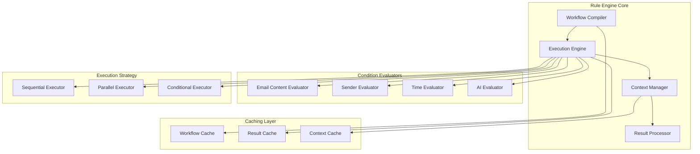

## Data Flow Diagrams

### Email Processing Flow

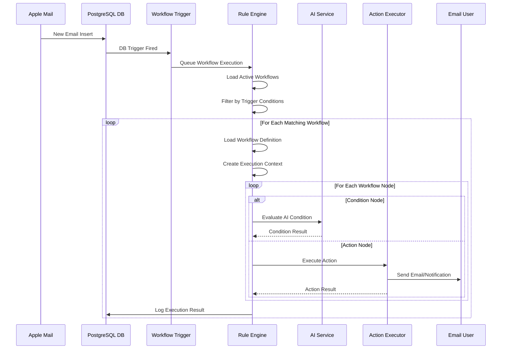

### Workflow Creation Flow

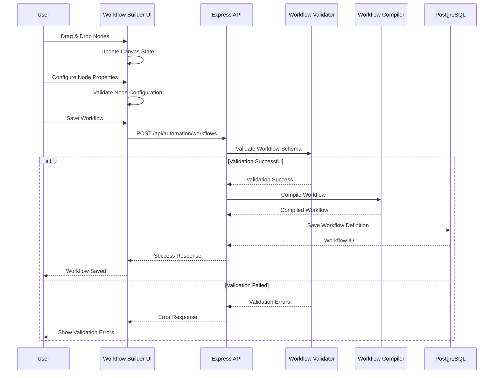

### Action Execution Flow

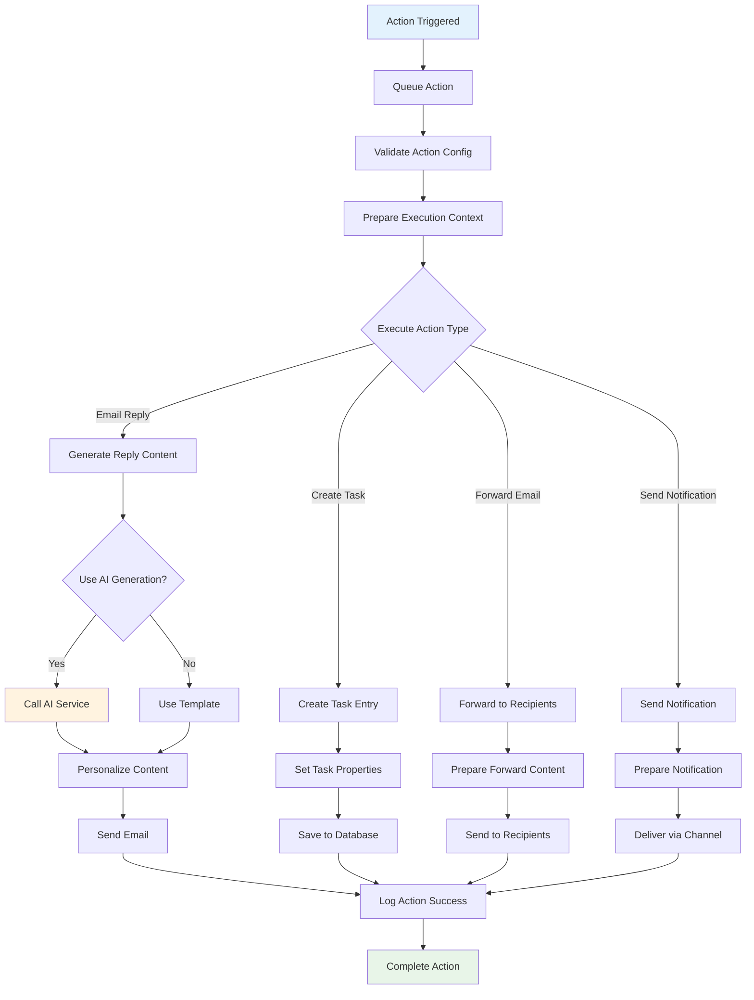

## Database Schema Diagram

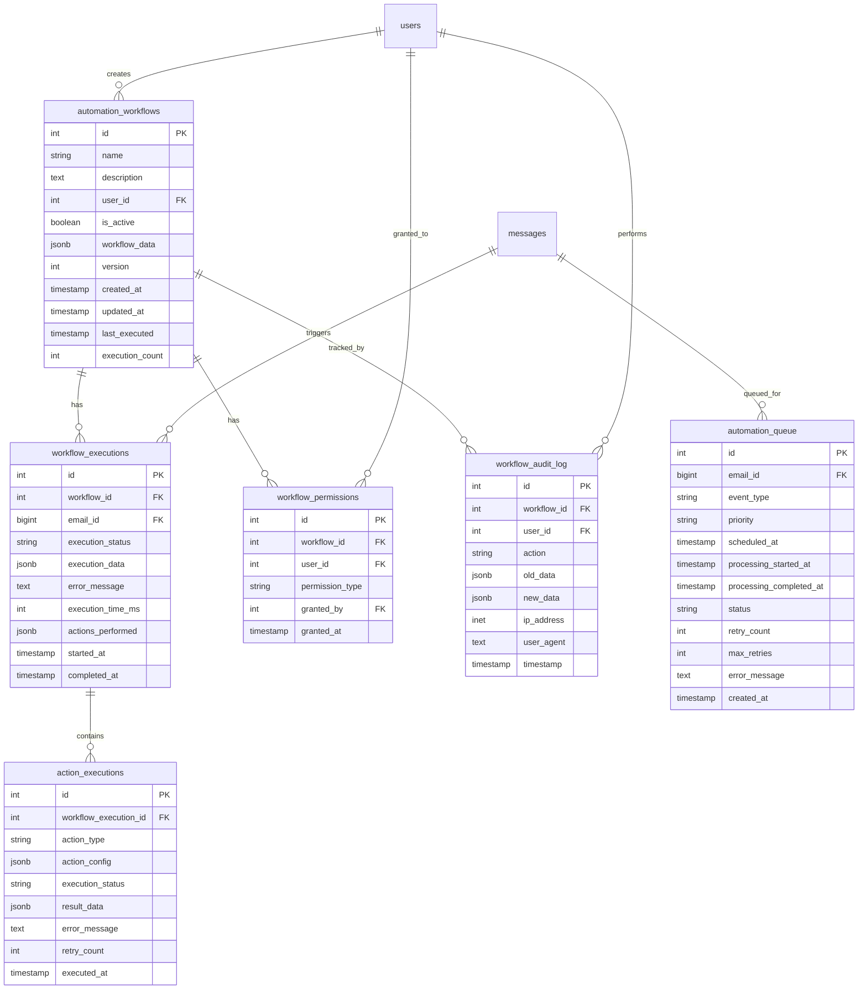

## Technology Stack Architecture

```mermaid
graph TB
    subgraph "Frontend Technologies"
        React[React 18]
        TypeScript[TypeScript]
        Tailwind[Tailwind CSS]
        ReactFlow[React Flow - Visual Editor]
        Zustand[Zustand - State Management]
    end
    
    subgraph "Backend Technologies"
        NodeJS[Node.js]
        Express[Express.js]
        JWT[JWT Authentication]
        Helmet[Security Middleware]
        Winston[Logging]
    end
    
    subgraph "Database Technologies"
        PostgreSQL[PostgreSQL 14+]
        Redis[Redis Cache]
        Triggers[Database Triggers]
        JSONB[JSONB for Workflow Data]
    end
    
    subgraph "AI/ML Technologies"
        OpenAI[OpenAI GPT-5]
        Embedding[Text Embeddings]
        Sentiment[Sentiment Analysis]
        Classification[Email Classification]
    end
    
    subgraph "Infrastructure"
        Docker[Docker Containers]
        Nginx[Nginx Reverse Proxy]
        PM2[PM2 Process Manager]
        LogRotation[Log Rotation]
    end
    
    subgraph "External Integrations"
        SMTP[SMTP/IMAP Servers]
        AppleMail[Apple Mail Integration]
        WebHooks[Webhook Endpoints]
        Calendar[Calendar APIs]
    end
    
    React --> TypeScript
    React --> Tailwind
    React --> ReactFlow
    React --> Zustand
    
    NodeJS --> Express
    Express --> JWT
    Express --> Helmet
    Express --> Winston
    
    PostgreSQL --> Triggers
    PostgreSQL --> JSONB
    Redis --> PostgreSQL
    
    OpenAI --> Embedding
    OpenAI --> Sentiment
    OpenAI --> Classification
    
    Docker --> Nginx
    Docker --> PM2
    Docker --> LogRotation
    
    SMTP --> AppleMail
    WebHooks --> Calendar
```

## Deployment Architecture

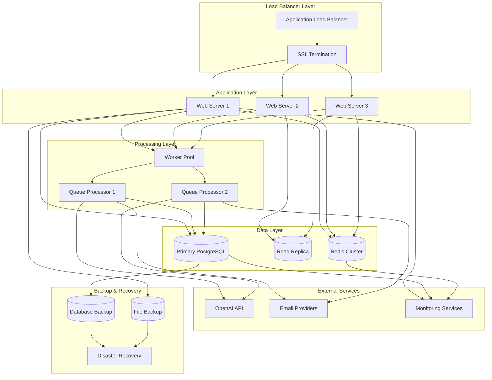

## Security Architecture

```mermaid
graph TB
    subgraph "Authentication Layer"
        JWTAuth[JWT Authentication]
        OAuth[OAuth Integration]
        MFA[Multi-Factor Auth]
        SessionMgmt[Session Management]
    end
    
    subgraph "Authorization Layer"
        RBAC[Role-Based Access Control]
        WorkflowPermissions[Workflow Permissions]
        APIPermissions[API Permissions]
        ResourceGuards[Resource Guards]
    end
    
    subgraph "Data Security"
        Encryption[Data Encryption at Rest]
        TLS[TLS in Transit]
        KeyManagement[Key Management]
        DataMasking[Sensitive Data Masking]
    end
    
    subgraph "Input Validation"
        SchemaValidation[Schema Validation]
        SQLInjectionPrevention[SQL Injection Prevention]
        XSSProtection[XSS Protection]
        CSRFProtection[CSRF Protection]
    end
    
    subgraph "Monitoring & Audit"
        AuditLogging[Audit Logging]
        SecurityMonitoring[Security Monitoring]
        IntrusionDetection[Intrusion Detection]
        AlertSystem[Security Alert System]
    end
    
    JWTAuth --> RBAC
    OAuth --> RBAC
    MFA --> SessionMgmt
    
    RBAC --> WorkflowPermissions
    RBAC --> APIPermissions
    RBAC --> ResourceGuards
    
    Encryption --> KeyManagement
    TLS --> Encryption
    DataMasking --> Encryption
    
    SchemaValidation --> SQLInjectionPrevention
    XSSProtection --> CSRFProtection
    CSRFProtection --> SchemaValidation
    
    AuditLogging --> SecurityMonitoring
    SecurityMonitoring --> IntrusionDetection
    IntrusionDetection --> AlertSystem
```

This comprehensive set of diagrams provides multiple perspectives on the automation workflow system architecture, from high-level system context down to detailed component interactions and deployment considerations. Each diagram serves a specific purpose in understanding and communicating the system design to different stakeholders.