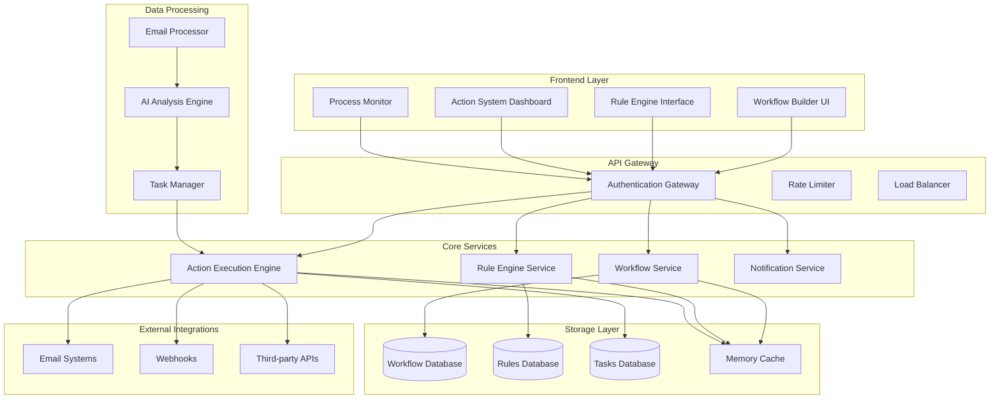

# Email Task Management Automation Workflow System Architecture

## Executive Summary

This document outlines the architecture for an advanced automation workflow interface for email task management, designed to create sophisticated email processing workflows with a visual builder UI, intelligent rule engine, and comprehensive automated action system.

## System Overview



## Key Components

### 1. Workflow Builder UI
- Visual drag-and-drop interface for creating automation workflows
- Pre-built template library for common email scenarios
- Real-time validation and testing capabilities
- Integration with existing EmailRulesManager

### 2. Enhanced Rule Engine
- Multi-condition complex logic support (AND/OR/NOT combinations)
- AI-powered pattern recognition for intelligent rule suggestions
- Context-aware rule evaluation with machine learning
- Dynamic rule adaptation based on performance metrics

### 3. Advanced Action System
- Multi-step sequential and parallel action execution
- Conditional branching with decision trees
- Integration with external systems via webhooks and APIs
- Rollback and error handling capabilities

### 4. Process Orchestration
- Workflow state management with persistence
- Event-driven architecture for real-time processing
- Queue-based action execution with priority handling
- Comprehensive audit trail and logging

## Architecture Principles

### Scalability
- Microservices architecture for independent scaling
- Event-driven design for loose coupling
- Horizontal scaling with load balancing
- Caching strategy for optimal performance

### Security
- Zero-trust security model
- End-to-end encryption for sensitive data
- Role-based access control (RBAC)
- Audit logging for compliance

### Reliability
- Circuit breaker pattern for fault tolerance
- Redundancy and failover mechanisms
- Data backup and disaster recovery
- Health monitoring and alerting

### Extensibility
- Plugin architecture for custom actions
- RESTful APIs for third-party integrations
- Webhook support for external notifications
- Template marketplace for sharing workflows

## Technology Stack

### Frontend
- React 18+ with TypeScript
- Material-UI for design system consistency
- React Flow for visual workflow builder
- WebSocket for real-time updates

### Backend
- Node.js with Express.js
- PostgreSQL for persistent storage
- Redis for caching and session management
- WebSocket for real-time communication

### Infrastructure
- Docker containers for deployment
- Kubernetes for orchestration
- Prometheus for monitoring
- Grafana for analytics dashboard

## Integration Points

### Existing Systems
- Builds upon current EmailRulesManager component
- Integrates with existing task management system
- Leverages current AI analysis capabilities
- Extends database schema for workflow storage

### External Services
- Email providers (IMAP/SMTP/Exchange)
- Calendar systems (Google Calendar, Outlook)
- Project management tools (Asana, Trello, Jira)
- Communication platforms (Slack, Teams)

## Performance Requirements

### Latency
- Sub-100ms response time for UI interactions
- Sub-500ms for rule evaluation
- Sub-1s for action execution initiation

### Throughput
- Support 10,000+ emails per hour processing
- Handle 1,000+ concurrent workflow executions
- Scale to 100+ simultaneous users

### Availability
- 99.9% uptime SLA
- 24/7 monitoring and alerting
- Automated failover capabilities

## Data Models

### Workflow Schema
```sql
CREATE TABLE workflows (
    id UUID PRIMARY KEY,
    name VARCHAR(255) NOT NULL,
    description TEXT,
    definition JSONB NOT NULL,
    status workflow_status NOT NULL DEFAULT 'draft',
    version INTEGER NOT NULL DEFAULT 1,
    created_by UUID REFERENCES users(id),
    created_at TIMESTAMP DEFAULT NOW(),
    updated_at TIMESTAMP DEFAULT NOW()
);
```

### Rule Engine Enhancement
```sql
CREATE TABLE workflow_rules (
    id UUID PRIMARY KEY,
    workflow_id UUID REFERENCES workflows(id),
    name VARCHAR(255) NOT NULL,
    conditions JSONB NOT NULL,
    actions JSONB NOT NULL,
    priority INTEGER DEFAULT 100,
    enabled BOOLEAN DEFAULT true
);
```

### Action Execution Tracking
```sql
CREATE TABLE action_executions (
    id UUID PRIMARY KEY,
    workflow_id UUID REFERENCES workflows(id),
    rule_id UUID REFERENCES workflow_rules(id),
    email_id VARCHAR(255),
    action_type VARCHAR(100),
    status execution_status NOT NULL,
    result JSONB,
    started_at TIMESTAMP DEFAULT NOW(),
    completed_at TIMESTAMP
);
```

## Security Architecture

### Authentication & Authorization
- JWT-based authentication with refresh tokens
- Role-based permissions (Admin, Editor, Viewer)
- API key management for external integrations
- Multi-factor authentication support

### Data Protection
- Encryption at rest for sensitive data
- TLS 1.3 for data in transit
- PII anonymization for analytics
- GDPR compliance measures

### Access Control
- Workflow-level permissions
- Resource-based authorization
- IP allowlisting for admin functions
- Session management with timeout

## Monitoring & Observability

### Metrics Collection
- Workflow execution metrics
- Rule performance analytics
- User interaction tracking
- System resource utilization

### Alerting
- Failed workflow notifications
- Performance degradation alerts
- Security incident notifications
- Capacity planning warnings

### Logging
- Structured logging with correlation IDs
- Centralized log aggregation
- Real-time log streaming
- Long-term log retention

## Deployment Strategy

### Development Environment
- Local Docker Compose setup
- Hot reload for development
- Mock external services
- Test data seeding

### Staging Environment
- Production-like infrastructure
- Automated testing pipeline
- Performance testing
- Security scanning

### Production Environment
- Blue-green deployment strategy
- Automated rollback capabilities
- Health checks and monitoring
- Disaster recovery procedures

## Future Enhancements

### AI-Powered Features
- Smart workflow recommendations
- Predictive rule optimization
- Natural language workflow creation
- Anomaly detection in email patterns

### Advanced Integrations
- Voice assistant integration
- Mobile app support
- IoT device connections
- Blockchain-based audit trails

### Enterprise Features
- Multi-tenant architecture
- Advanced analytics dashboard
- Custom branding options
- Professional services integration