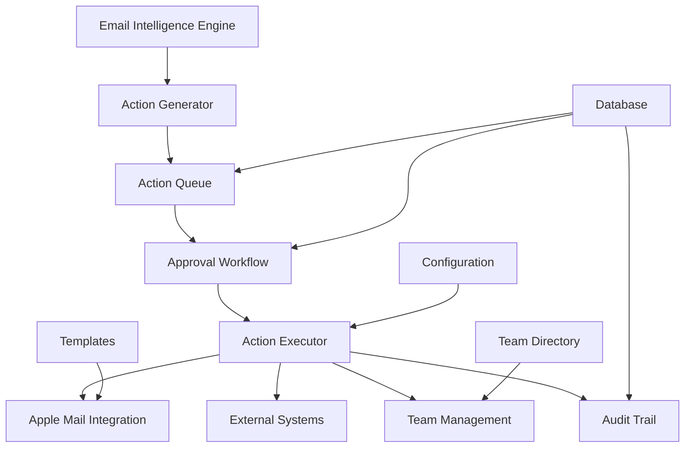

# Email Action Executor System

A comprehensive email action execution engine designed for Apple Mail integration with intelligent task automation, approval workflows, and team collaboration.

## 🚀 Overview

The Email Action Executor is a sophisticated backend system that:

- **Processes email-derived actions** automatically based on AI classification
- **Manages approval workflows** for sensitive operations
- **Integrates with Apple Mail** via AppleScript for seamless email handling
- **Supports external systems** like Jira, Asana, Calendar, and file storage
- **Provides undo capabilities** with comprehensive audit trails
- **Manages team assignments** with skill-based task routing

## 🏗️ System Architecture



## 📦 Core Components

### 1. EmailActionExecutor
Main orchestration engine that manages the entire action lifecycle.

**Key Features:**
- Queue-based processing with priority handling
- Multi-threaded execution with configurable concurrency
- Graceful shutdown and error handling
- Comprehensive statistics and monitoring

### 2. Action Types
Support for 12 different action types:

- `SEND_REPLY` - Generate and send email replies
- `FORWARD_EMAIL` - Forward emails to team members
- `CREATE_TASK` - Create tasks in project management systems
- `SCHEDULE_MEETING` - Schedule calendar events
- `SET_REMINDER` - Create reminders
- `ARCHIVE_EMAIL` - Archive emails to appropriate folders
- `UPLOAD_FILE` - Upload files to cloud storage
- `DELEGATE_TASK` - Delegate tasks to team members
- `MARK_COMPLETE` - Mark tasks as completed
- `FOLLOW_UP` - Schedule follow-up actions
- `APPROVE_REQUEST` - Process approval requests
- `ESCALATE` - Escalate issues to higher levels

### 3. Approval Workflow
Sophisticated approval system for sensitive operations:

- **Configurable approval requirements** by action type
- **Role-based approver assignment**
- **Email notifications** with approve/reject links
- **Timeout handling** and escalation
- **Audit trail** for all approval decisions

### 4. Team Management
Intelligent team member management and assignment:

- **Skill-based task routing**
- **Availability tracking**
- **Workload balancing**
- **Role hierarchy support**

## 🛠️ Installation & Setup

### Prerequisites
- Python 3.8+
- macOS with Apple Mail
- SQLite3
- Required Python packages: `subprocess`, `sqlite3`, `json`, `datetime`

### Quick Start

1. **Clone and setup:**
```bash
git clone <repository>
cd apple-mcp
pip install -r requirements.txt
```

2. **Initialize the system:**
```python
from email_action_executor import EmailActionExecutor

executor = EmailActionExecutor()
executor.start()
```

3. **Run the demo:**
```bash
python demo_email_action_executor.py
```

### Configuration Files

#### action_config.json
Main configuration for the system:

```json
{
  "approval_required_actions": ["CREATE_TASK", "DELEGATE_TASK"],
  "max_concurrent_actions": 5,
  "external_integrations": {
    "jira": {"enabled": false, "url": "", "token": ""},
    "calendar": {"enabled": true}
  },
  "security": {
    "require_approval_for_external": true,
    "allowed_domains": ["company.com"]
  }
}
```

#### team_directory.json
Team member information:

```json
[
  {
    "name": "Sarah Johnson",
    "email": "sarah.johnson@company.com",
    "role": "Engineering Manager",
    "skills": ["engineering", "project_management"],
    "availability": "available"
  }
]
```

## 📧 Email Templates

The system includes customizable email templates for:

- **Approval requests** - Formatted approval notifications
- **Task assignments** - Professional task delegation emails
- **Meeting invitations** - Calendar event notifications
- **Escalation notices** - Urgent issue escalations

Templates support variable substitution and can be customized per organization.

## 🔧 Integration Guide

### Apple Mail Integration

The system uses AppleScript for Apple Mail operations:

```applescript
tell application "Mail"
    -- Create new email
    set newMessage to make new outgoing message with properties {
        subject: "Auto-generated Reply",
        content: "Thank you for your email..."
    }
end tell
```

### External System Integration

#### Jira Integration
```python
def _create_jira_task(self, title, description, assignee, due_date, project):
    # Jira API integration
    headers = {"Authorization": f"Bearer {self.jira_token}"}
    payload = {
        "fields": {
            "project": {"key": project},
            "summary": title,
            "description": description,
            "assignee": {"name": assignee}
        }
    }
    # Post to Jira API
```

#### Calendar Integration
```python
def _create_calendar_event(self, title, start_time, end_time, attendees):
    # AppleScript calendar integration
    script = f'''
    tell application "Calendar"
        make new event with properties {{
            summary: "{title}",
            start date: date "{start_time}",
            end date: date "{end_time}"
        }}
    end tell
    '''
```

## 🎯 Usage Examples

### Basic Action Submission

```python
from email_action_executor import EmailActionExecutor, ActionType, Priority, ExecutionContext

executor = EmailActionExecutor()
executor.start()

# Create execution context
context = ExecutionContext(
    user_id="user@company.com",
    session_id="session-123",
    email_id="email-456"
)

# Submit a reply action
action_id = executor.submit_action(
    action_type=ActionType.SEND_REPLY,
    parameters={
        "message_id": "msg-123",
        "reply_content": "Thank you for your email. I'll review and respond."
    },
    context=context,
    priority=Priority.HIGH
)

print(f"Action submitted: {action_id}")
```

### Task Creation with Assignment

```python
# Create task with intelligent assignee suggestion
suggested_assignee = executor.suggest_assignee(
    task_description="Debug API performance issues",
    required_skills=["backend", "database"]
)

action_id = executor.submit_action(
    action_type=ActionType.CREATE_TASK,
    parameters={
        "title": "API Performance Investigation",
        "description": "Investigate and fix API response time issues",
        "assignee": suggested_assignee,
        "due_date": "2024-08-20T17:00:00",
        "project": "backend"
    },
    context=context,
    priority=Priority.HIGH
)
```

### Meeting Scheduling

```python
action_id = executor.submit_action(
    action_type=ActionType.SCHEDULE_MEETING,
    parameters={
        "title": "Architecture Review",
        "attendees": ["team@company.com"],
        "start_time": "2024-08-22T14:00:00",
        "duration": 90,
        "location": "Conference Room A",
        "description": "Review system architecture for Q4"
    },
    context=context,
    priority=Priority.MEDIUM
)
```

## 🔐 Security Features

### Approval Requirements
- **Configurable approval thresholds** by action type
- **Domain restrictions** for email forwarding
- **External integration controls**
- **User permission validation**

### Audit Trail
- **Complete action history** with timestamps
- **User attribution** for all operations
- **Change tracking** with before/after states
- **Compliance reporting** capabilities

### Data Protection
- **Sensitive data masking** in logs
- **Encrypted configuration** options
- **Access control** for administrative functions
- **Secure token management**

## 📊 Monitoring & Analytics

### Real-time Statistics
```python
stats = executor.get_statistics()
print(f"Success rate: {stats['success_rate_percent']:.1f}%")
print(f"Average execution time: {stats['average_execution_time_ms']:.1f}ms")
print(f"Active actions: {stats['active_actions']}")
```

### Health Checks
- **System component status**
- **External integration health**
- **Database connectivity**
- **Queue processing performance**

### Performance Metrics
- **Action execution times**
- **Success/failure rates**
- **Resource utilization**
- **User activity patterns**

## 🔄 Undo Capabilities

The system provides comprehensive undo functionality:

```python
# Actions create undo tokens when executed
result = executor.get_action_status(action_id)
undo_token = result.get('undo_token')

# Undo the action if needed
if undo_token:
    success = executor.undo_action(undo_token)
    print(f"Undo successful: {success}")
```

**Supported Undo Operations:**
- Delete created tasks
- Cancel scheduled meetings
- Remove sent emails (where possible)
- Restore archived emails
- Revoke approvals

## 🚦 Error Handling & Retry Logic

### Automatic Retry
- **Configurable retry delays**: [1s, 5s, 15s]
- **Exponential backoff** for external API calls
- **Circuit breaker** patterns for failing services
- **Dead letter queue** for permanently failed actions

### Error Recovery
- **Graceful degradation** when external services are unavailable
- **Fallback mechanisms** for critical operations
- **User notification** for failed actions requiring intervention

## 📈 Scalability Considerations

### Performance Optimization
- **Queue-based processing** for high throughput
- **Connection pooling** for database operations
- **Caching** for frequently accessed data
- **Batch processing** for bulk operations

### Horizontal Scaling
- **Stateless execution engine** design
- **Shared database** for coordination
- **Load balancing** across multiple instances
- **Distributed queue** support

## 🧪 Testing

### Unit Tests
```bash
python -m pytest tests/test_email_action_executor.py
```

### Integration Tests
```bash
python -m pytest tests/test_integration.py
```

### Demo & Load Testing
```bash
python demo_email_action_executor.py
python load_test_executor.py
```

## 🔧 API Reference

### Core Methods

#### submit_action(action_type, parameters, context, priority=MEDIUM)
Submit an action for execution.

**Parameters:**
- `action_type`: ActionType enum value
- `parameters`: Dict of action-specific parameters
- `context`: ExecutionContext object
- `priority`: Priority enum value

**Returns:** Action ID string

#### get_action_status(action_id)
Get current status of an action.

**Returns:** Dictionary with action details

#### approve_action(approval_id, approver_id, comments="")
Approve a pending action.

**Returns:** Boolean success status

#### undo_action(undo_token)
Undo a previously executed action.

**Returns:** Boolean success status

#### get_statistics()
Get system execution statistics.

**Returns:** Dictionary with performance metrics

## 🤝 Contributing

1. Fork the repository
2. Create a feature branch
3. Make your changes
4. Add tests for new functionality
5. Submit a pull request

## 📄 License

MIT License - see LICENSE file for details.

## 📞 Support

For issues and questions:
- Create an issue in the repository
- Check the demo script for usage examples
- Review the configuration documentation

## 🗺️ Roadmap

### Near Term
- [ ] Enhanced Slack integration
- [ ] Microsoft Teams support
- [ ] Advanced scheduling algorithms
- [ ] Machine learning for assignment optimization

### Long Term
- [ ] Natural language action parsing
- [ ] Multi-tenant support
- [ ] Advanced analytics dashboard
- [ ] Mobile app integration
- [ ] Voice command support

---

Built with ❤️ for efficient email workflow automation.